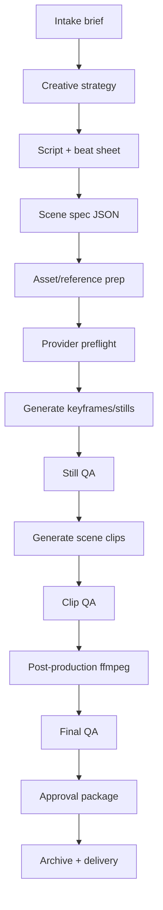

# AI Video Production Pipeline Research — 2026-06-10

Owner: Hồng Quảng / Hermes
Status: production research draft
Tags: #ai-video #production-pipeline #hermes-video-pipeline

## Executive decision

Build the production pipeline as a **scene-first, image-first, provider-agnostic video factory**:

1. Script/storyboard is the source of truth.
2. Generate or verify still keyframes before video.
3. Render short clips through swappable providers.
4. Do deterministic post-production locally with ffmpeg.
5. QA every final video with ffprobe + contact sheet before delivery.
6. Keep state files, prompts, request IDs, source assets, and final artifacts for reruns.

This avoids the main failure modes seen in current AI video: inconsistent characters, caption leakage, provider quota errors, expired URLs, audio mismatch, and stale files being accidentally resent.

## Grounded source notes

### Internal Hermes / current workspace lessons

- Existing umbrella skill: `ai-media-production-workflows`.
- Known good social-video loop: storyboard → image-first scene refs → image-to-video clips → concat → VO/BGM → ffprobe/contact-sheet QA.
- Provider state from skills:
  - AutoVideo/Veo and Vertex AI Veo are primary for Google/Veo-style output when credentials/quota work.
  - RunningHub is a working fallback for image/video/TTS/music with model menu and many providers.
  - Composio Gemini/Veo path has historically been useful but model/version/session constraints must be checked each run.
- Existing hard lessons:
  - Always preflight provider account/model before spending credits.
  - Do not put full narration in video prompt if no subtitles/on-screen text is required; some models burn captions.
  - Use unique output filenames for rerenders to avoid Telegram/client cache confusion.
  - Use ffmpeg re-encode for concat, not stream-copy, to avoid AAC/DTS glitches.
  - Verify final duration, streams, resolution, and contact sheet before saying done.

### External docs checked 2026-06-10

- Google AI Gemini API Veo docs: `https://ai.google.dev/gemini-api/docs/video`
  - Veo 3.1 supports programmatic generation.
  - Docs describe 720p/1080p/4K, native audio, 16:9 and 9:16, and short clips commonly 4/6/8s depending model/config.
- Google Cloud Vertex AI Veo docs: `https://cloud.google.com/vertex-ai/generative-ai/docs/video/generate-videos`
  - Vertex docs state Veo can generate 720p/1080p/4K, 16:9 or 9:16, 4/6/8s clips, audio/dialogue, extension, first/last frame flows.
- OpenAI Sora API docs: `https://platform.openai.com/docs/guides/video-generation`
  - Sora API supports async video jobs, prompt generation, image references, character reuse, extension/editing/management.
  - Sora 2 / Sora 2 Pro support 16s/20s generations; Sora 2 Pro is positioned for production-quality/high-res cinematic/marketing assets with 1080p exports.
- Luma API page: `https://lumalabs.ai/api`
  - Luma positions Ray API for cinematic workflows, 1080p, video-to-video up to 20s, HDR/EXR options, keyframes and sequence-level control, reframe/V2V workflows.
- HeyGen docs: `https://docs.heygen.com/`
  - Best fit: avatar/talking-head, video translation, lipsync, TTS/voices, one-prompt video agent.
- Synthesia docs: `https://docs.synthesia.io/`
  - Best fit: structured corporate/avatar videos; docs expose API and llms.txt index.

## Production pipeline architecture



## Standard folder layout

```text
/video-jobs/{client}/{campaign}/{yyyymmdd}-{slug}/
  brief.md
  scene_spec.json
  prompts/
    scene_01_image.txt
    scene_01_video.txt
  refs/
    brand_logo.png
    product_01.png
    character_master.jpg
  keyframes/
    s01.jpg
    s02.jpg
  clips/
    s01.mp4
    s02.mp4
  audio/
    vo.wav
    bgm.wav
    mix.wav
  post/
    concat_list.txt
    final_master.mp4
    final_telegram_compressed.mp4
    contact_sheet.jpg
    probe.json
  state.json
  qa_report.md
```

## Canonical scene spec schema

```json
{
  "job_id": "20260610-client-campaign",
  "platform": "facebook_reels|tiktok|youtube_shorts|ad",
  "aspect_ratio": "9:16",
  "target_duration_sec": 30,
  "brand_rules": {
    "logo_required": false,
    "no_on_screen_text": true,
    "safe_claims": true
  },
  "voice": {
    "mode": "external_tts|provider_native|none",
    "language": "vi-VN",
    "tone": "warm, credible, direct"
  },
  "scenes": [
    {
      "id": 1,
      "duration_sec": 6,
      "purpose": "hook",
      "visual_action": "...",
      "vo_line": "...",
      "keyframe_prompt": "...",
      "video_prompt": "...",
      "negative_prompt": "no subtitles, no captions, no typography, no watermark",
      "refs": ["character_master.jpg"],
      "provider": "auto"
    }
  ]
}
```

## Recommended provider routing

### 1. Social ads / cinematic short clips

Primary:
- Veo 3.1 / Vertex AI / Gemini API when quota and credentials are healthy.
- Sora 2 Pro where OpenAI API access/price fits and longer 16–20s scenes are useful.

Fallbacks:
- Luma Ray for cinematic, V2V, keyframe/sequence control, HDR/EXR workflows.
- RunningHub models for practical fallback across Kling/Vidu/Hailuo/Seedance/etc.
- AutoVideo.app when active account exposes Veo models and token is fresh.

### 2. Character-consistent multi-scene reels

Primary strategy:
- Image-first: locked character reference / master still.
- I2V per scene.
- Keep scenes 4–8s each unless using Sora/Luma longer clips.
- Local ffmpeg concat.

Avoid:
- Pure T2V for every scene when the same person/mascot/product must persist.
- Asking I2V to add new distant subjects not present in reference; pre-compose the final frame or use first+last frame.

### 3. Talking-head / spokesperson / education explainers

Primary:
- HeyGen or Synthesia for avatar, translation, lipsync, scalable training videos.

Use when:
- Script accuracy, lip-sync, brand voice, and repeatable presenter are more important than cinematic b-roll.

### 4. Product/video ads

Primary:
- Product reference image → keyframe enhancement → I2V.
- For exact packshot/logo/text: use deterministic overlay after AI render, not inside AI generation.

Rule:
- AI video models still corrupt text/logos. Put legal text, prices, CTA, logo, QR, app badges in post-production overlays.

## Voice/audio strategy

### Mode A — provider-native audio

Use when:
- Natural scene audio/dialogue is desired.
- The model is known to produce acceptable Vietnamese VO.

Risks:
- Narration in prompt can trigger burned subtitles/on-screen words.
- Voice consistency may vary scene to scene.

### Mode B — external TTS + silent visuals (recommended default)

Use when:
- No subtitles/text is hard requirement.
- Need consistent narrator across scenes.
- Need editability and safer revisions.

Flow:
1. Generate visual-only clips with `silent, no speaking, no captions`.
2. Generate VO separately.
3. Mix BGM under VO.
4. Add subtitles as deterministic post overlay only if requested.

### Audio mix defaults

- VO loudness: normalize around -16 LUFS for social.
- BGM: duck under voice; usually -24 to -30 LUFS relative feel.
- Export AAC 128–192kbps, 48kHz.

## QA gates

### Gate 0 — brief sanity

- Objective clear?
- Platform and aspect ratio known?
- Duration known?
- Brand/product assets verified?
- Claims/compliance reviewed?

### Gate 1 — still/keyframe QA

- Character/product correct.
- No bad hands/faces/logo corruption.
- No accidental text/watermark.
- Style matches campaign.

### Gate 2 — clip QA

- Motion matches visual action.
- No unwanted captions/subtitles/typography.
- No flicker, morphing, broken anatomy, product mutation.
- Same character/style across clips.

### Gate 3 — final QA

Commands:

```bash
ffprobe -v error -show_format -show_streams -print_format json final_master.mp4 > probe.json
ffmpeg -y -i final_master.mp4 -vf "fps=1/3,scale=240:-1,tile=5x4" contact_sheet.jpg
```

Check:
- Duration matches target.
- Resolution/aspect ratio correct.
- Video and audio streams present.
- File size fits delivery target.
- Contact sheet has no unwanted text/watermark/corrupt frames.
- First frame/thumbnail is not black; send preview frame with Telegram videos when needed.

## Engineering rules

### State management

`state.json` should track:
- provider used
- model
- request/job IDs
- prompt hash
- source refs
- output URL
- local downloaded path
- status: `pending|submitted|processing|completed|failed`
- error message
- retries
- qa status

Never use file existence alone as proof of current output; compare prompt hash + state status.

### Retry policy

- Network/download: retry 3x with exponential backoff.
- Provider processing errors: retry 1–2x if transient; then fallback provider.
- Auth/token failures: re-login once; do not burn render attempts.
- RAI/safety blocks: rewrite prompt category words; do not repeat same blocked prompt 5x.
- Partial batch: continue other scenes; do not `break` entire day on one failure.

### Deterministic post-production

Use ffmpeg/ImageMagick/Python for:
- concat
- resizing/padding/cropping
- captions/subtitles
- logos/CTA/legal overlays
- audio mix
- compression variants
- preview frame/contact sheet

Do not rely on AI model to render exact UI text, price, phone, QR, or logo.

## MVP implementation plan

### Phase 1 — Manual-but-production-safe runner

Build a Python CLI:

```bash
video_factory new --brief brief.md --client evafamily --platform reels
video_factory plan job_dir/
video_factory render-keyframes job_dir/
video_factory render-clips job_dir/ --provider auto
video_factory assemble job_dir/
video_factory qa job_dir/
video_factory package job_dir/ --telegram
```

Minimum features:
- scene_spec.json validation
- provider adapter interface
- state.json resume
- ffprobe/contact sheet QA
- final compressed Telegram variant

### Phase 2 — Provider adapters

Implement adapters behind one interface:

```python
class VideoProvider:
    def preflight(self) -> ProviderStatus: ...
    def generate_image(self, scene) -> Asset: ...
    def generate_video(self, scene, refs) -> Clip: ...
    def poll(self, job_id) -> JobStatus: ...
    def download(self, job_id, out_path) -> Path: ...
```

Adapters:
- `vertex_veo`
- `openai_sora`
- `luma`
- `runninghub`
- `autovideo`
- `local_safe_motion` fallback

### Phase 3 — QA automation

Automated checks:
- ffprobe parse
- black-frame detection
- scene duration validation
- audio stream presence
- contact sheet generation
- optional vision model review against checklist

### Phase 4 — Approval and delivery

- Generate `approval_package.md` with thumbnail/contact sheet/final path/provider/cost/errors.
- Upload/backup to Drive/Obsidian/assets if client-important.
- For public posting, require explicit approval unless workflow already approved.

## Suggested production defaults for anh

For Vietnamese short-form ads/Reels:

- Aspect ratio: 9:16.
- Scene duration: 5–8s.
- 30s ad: 5 scenes × 6s.
- 60s educational: 8 scenes × 7–8s.
- Default: external Vietnamese VO + silent visuals to avoid burned captions.
- Add subtitles in post only when requested.
- Always export two versions:
  - master: high quality H.264/AAC
  - telegram/social preview: compressed <10–20MB

## Risks and mitigations

- Provider quota/credential drift → preflight every run; adapters with fallback.
- Caption leakage → do not include VO text in visual prompt; use external TTS.
- Character inconsistency → image-first refs, master stills, first/last frame.
- Text/logo corruption → deterministic overlays in post.
- Stale assets → state with prompt hash, unique filenames.
- Failed long batch → scene-level status, resume, no break-on-first-failure.
- Telegram black thumbnail → send preview frame alongside video.

## Immediate next build recommendation

Build `video_factory` locally as a reusable Hermes script first, not a web app:

1. Start with schema + local ffmpeg assembly + QA.
2. Add RunningHub and AutoVideo adapters because local skills already contain working commands/details.
3. Add Vertex/Sora/Luma adapters as credentials/access are confirmed.
4. Save every job under `/home/node/video-jobs/` and important client finals under Obsidian/Assets.

This gives anh a real production machine quickly while keeping provider choice flexible.
